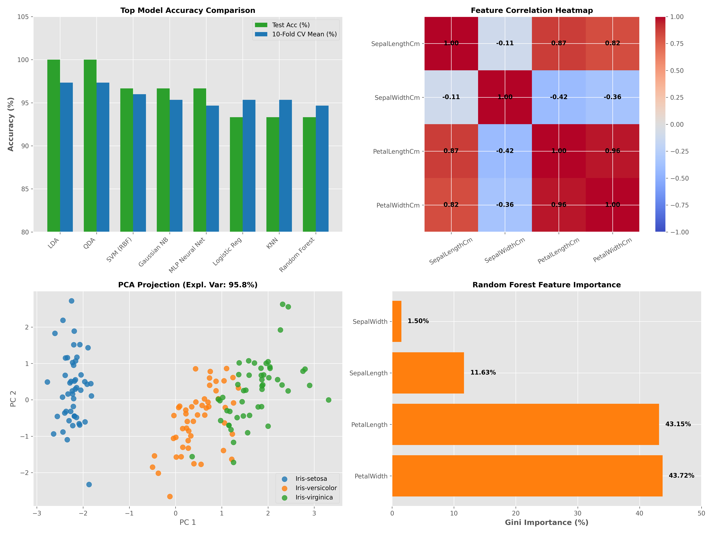

# Comprehensive Iris Dataset Analysis & 18-Model Benchmark

An end-to-end data science and machine learning repository performing exploratory data analysis, statistical hypothesis testing, 2D/3D dimensionality reduction, **18-model supervised classification benchmarking**, and unsupervised clustering on the Iris dataset.

---

## 📌 Repository Overview & Structure

```
├── README.md                          # Project documentation & summary leaderboard
├── LICENSE                            # MIT License
├── requirements.txt                   # Dependency requirements (streamlit, sklearn, etc.)
├── app.py                             # Interactive Streamlit Web Application
├── ANALYSIS_REPORT.md                 # Detailed report with statistics, charts, and analysis
├── Comprehensive_Iris_Analysis.ipynb  # Interactive Jupyter Notebook covering EDA, models & plots
├── Neural_Network.ipynb               # Original Keras ANN classification notebook
├── Iris.csv                           # Iris flower feature dataset (150 rows)
├── run_analysis.py                    # Primary analysis script (EDA, ANOVA, PCA, Core Models)
├── run_additional_models.py           # Extended benchmark script (11 additional ML models)
├── generate_charts.py                 # Script for generating individual chart figures
├── generate_master_dashboard.py       # Script generating combined master dashboard
├── analysis_results.json              # Core metrics & stats exported in JSON
├── extended_model_results.json        # Extended model benchmark metrics in JSON
└── charts/                            # Exported visualization figures
    ├── master_dashboard.png           # Combined dashboard (Accuracies, Correlations, PCA, Importance)
    ├── feature_boxplots.png           # Species feature boxplots
    ├── correlation_heatmap.png        # Bivariate feature correlation matrix
    ├── pca_projection.png             # 2D PCA variance projection plot
    └── lda_projection.png             # Linear Discriminant Analysis separation plot
```

---

## 🎨 Master Visual Dashboard



---

## 📊 Summary of Findings

1. **Key Feature Differentiators**:
   - `PetalLengthCm` and `PetalWidthCm` provide over **86%** of total predictive importance for species classification.
   - One-Way ANOVA testing confirms `PetalLength` ($F = 1179.03, p < 10^{-90}$) and `PetalWidth` ($F = 959.32, p < 10^{-84}$) are the top statistically significant features.

2. **Dimensionality Reduction**:
   - **PCA**: Top 2 principal components explain **95.80%** of total dataset variance.
   - **LDA**: Component 1 accounts for **99.15%** of class separability, proving complete linear separation of *Iris-setosa*.

3. **Supervised Classification Benchmarking (18 Models)**:
   - **Top Performers**: **Linear Discriminant Analysis (LDA)** and **Quadratic Discriminant Analysis (QDA)** achieved **100% test accuracy** and **97.33% 10-fold CV mean accuracy**.
   - **Non-Linear Models**: **SVM (RBF Kernel)**, **Gaussian Naive Bayes**, and **MLP Neural Network** achieved **96.67% test accuracy** ($94.67\% - 96.00\%$ CV score).

4. **Unsupervised Clustering**:
   - **K-Means ($k=3$)**: Achieved an **Adjusted Rand Index (ARI) of 0.6201** and **Normalized Mutual Information (NMI) of 0.6595** against true species labels.

---

## 🏆 Master 18-Model Leaderboard Benchmark

Models evaluated on an 80/20 stratified split with 10-Fold Stratified Cross-Validation:

| Rank | Model Category | Model Name | Test Accuracy | Precision | Recall | F1-Score | 10-Fold CV Mean (± Std) |
| :---: | :--- | :--- | :---: | :---: | :---: | :---: | :---: |
| 🥇 **1** | **Discriminant Analysis** | **Linear Discriminant Analysis (LDA)** | **100.0%** | **1.000** | **1.000** | **1.000** | **97.33% (±4.4%)** |
| 🥇 **2** | **Discriminant Analysis** | **Quadratic Discriminant Analysis (QDA)** | **100.0%** | **1.000** | **1.000** | **1.000** | **97.33% (±4.4%)** |
| 🥉 **3** | **Non-Linear Kernel** | **SVM (RBF Kernel)** | **96.67%** | **0.970** | **0.967** | **0.967** | **96.00% (±4.4%)** |
| 🏅 **4** | **Probabilistic** | **Gaussian Naive Bayes** | **96.67%** | **0.970** | **0.967** | **0.967** | **95.33% (±5.2%)** |
| 🏅 **5** | **Neural Network** | **MLP Neural Network** | **96.67%** | **0.970** | **0.967** | **0.967** | **94.67% (±5.8%)** |
| 🏅 **6** | **Linear Model** | **Logistic Regression** | **93.33%** | 0.933 | 0.933 | 0.933 | 95.33% (±5.2%) |
| 🏅 **7** | **Distance-Based** | **K-Nearest Neighbors (KNN)** | **93.33%** | 0.944 | 0.933 | 0.933 | 95.33% (±5.2%) |
| 🏅 **8** | **Ensemble** | **Random Forest** | **93.33%** | 0.933 | 0.933 | 0.933 | 94.67% (±5.0%) |
| 🏅 **9** | **Ensemble** | **Extra Trees Classifier** | **93.33%** | 0.933 | 0.933 | 0.933 | 95.33% (±5.2%) |
| 🏅 **10** | **Ensemble** | **AdaBoost Classifier** | **93.33%** | 0.933 | 0.933 | 0.933 | 95.33% (±5.2%) |
| 🏅 **11** | **Ensemble** | **Gradient Boosting** | **90.00%** | 0.902 | 0.900 | 0.900 | 94.00% (±4.7%) |
| 🏅 **12** | **Ensemble** | **Hist Gradient Boosting** | **90.00%** | 0.902 | 0.900 | 0.900 | 94.00% (±4.7%) |
| 🏅 **13** | **Tree-Based** | **Decision Tree** | **90.00%** | 0.902 | 0.900 | 0.900 | 93.33% (±5.2%) |
| 🏅 **14** | **Online Learning** | **Passive Aggressive Classifier** | **90.00%** | 0.902 | 0.900 | 0.900 | 85.33% (±10.7%) |
| 🏅 **15** | **Linear Neural** | **Perceptron** | **86.67%** | 0.867 | 0.867 | 0.862 | 87.33% (±9.2%) |
| 🏅 **16** | **Distance-Based** | **Radius Neighbors Classifier** | **86.67%** | 0.875 | 0.867 | 0.865 | 86.67% (±9.4%) |
| 🏅 **17** | **Centroid-Based** | **Nearest Centroid** | **83.33%** | 0.835 | 0.833 | 0.833 | 86.00% (±8.7%) |
| 🏅 **18** | **Linear Regularized** | **Ridge Classifier** | **76.67%** | 0.777 | 0.767 | 0.761 | 82.67% (±10.8%) |

---

## 🚀 How to Run Scripts & Launch Streamlit Web App

### 1. Launch Interactive Streamlit Web App 🌐
```bash
pip install -r requirements.txt
streamlit run app.py
```

### 2. Run Main EDA & Model Pipeline
```bash
python3 run_analysis.py
```

### 3. Run 18-Model Benchmarking
```bash
python3 run_additional_models.py
```

### 4. Generate Visual Charts & Master Dashboard
```bash
python3 generate_charts.py
python3 generate_master_dashboard.py
```

---

## 📜 License

This project is licensed under the [MIT License](LICENSE).

